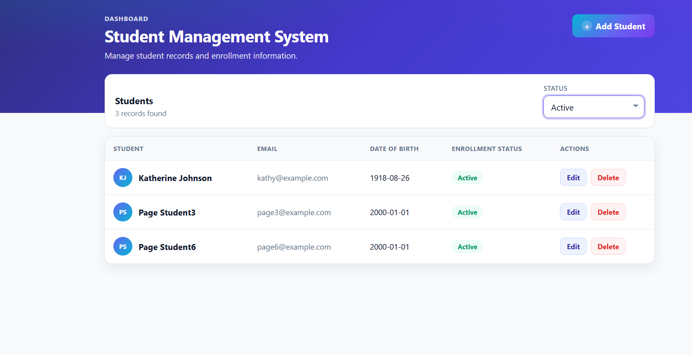
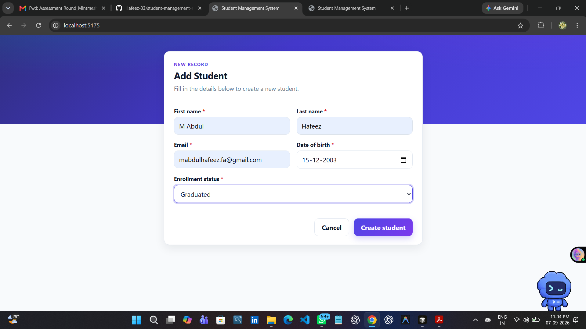
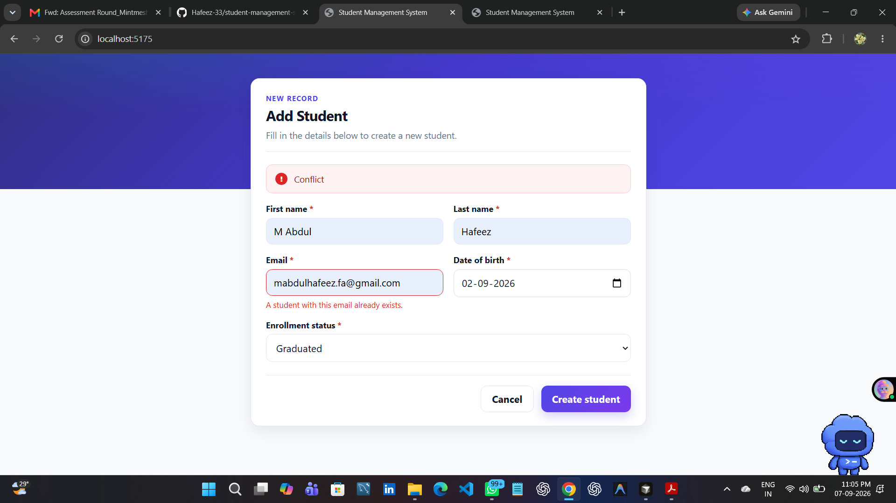
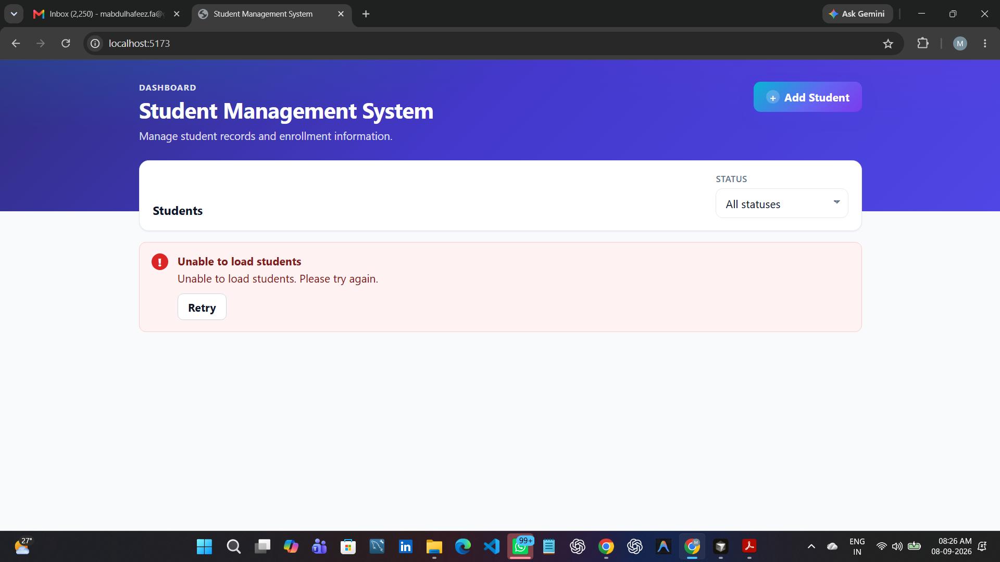

# Student Management System

## Overview

A fullstack CRUD app for student records: a Flask REST API with SQLite, and a Vue 3 SPA that lists, creates, edits, and deletes students.

## Features

- Create, read, update, and delete students
- Filter by enrollment status (`active`, `graduated`, `dropped`) via the API
- Server-side pagination (`page`, `per_page`)
- Backend validation (names, email, date of birth, status) plus client-side checks in the form
- Loading, empty, and error states in the list and form
- Duplicate email returns HTTP 409

## Tech Stack

**Backend:** Python, Flask, Flask-SQLAlchemy, SQLite, Flask-CORS  
**Frontend:** Vue 3, Vite, Axios  
**Tests:** Pytest (backend)

Flask matches the company’s preferred stack and is fast to stand up. SQLite needs no extra service for a take-home. Vue 3 is their preferred UI framework. Axios lives in a small service layer so components do not own HTTP details.

## Project Structure

```text
student-management-system/
├── README.md
├── DESIGN.md
├── screenshots/
├── backend/
│   ├── requirements.txt
│   ├── run.py
│   ├── app/
│   │   ├── __init__.py
│   │   ├── config.py
│   │   ├── extensions.py
│   │   ├── models.py
│   │   ├── schemas.py
│   │   └── routes.py
│   └── tests/
│       ├── conftest.py
│       └── test_students.py
└── frontend/
    ├── package.json
    ├── vite.config.js
    ├── .env.example
    └── src/
        ├── App.vue
        ├── main.js
        ├── api/students.js
        └── components/
            ├── StudentList.vue
            ├── StudentForm.vue
            ├── StatusFilter.vue
            └── Pagination.vue
```

## Setup and Run

From a clean clone. Backend must be running before the UI can load students.

### Backend

```powershell
cd backend
python -m venv .venv
.\.venv\Scripts\Activate.ps1
pip install -r requirements.txt
python run.py
```

API: [http://127.0.0.1:5000](http://127.0.0.1:5000)  
Health check: [http://127.0.0.1:5000/health](http://127.0.0.1:5000/health)

SQLite file `backend/students.db` is created on first run and is gitignored.

### Frontend

Copy `frontend/.env.example` to `frontend/.env` if you want an explicit API URL (defaults to `http://127.0.0.1:5000` if unset).

```powershell
cd frontend
copy .env.example .env
npm install
npm.cmd run dev
```

On Windows PowerShell, `npm` may fail if `npm.ps1` is blocked by execution policy. Use `npm.cmd` instead (do not change global execution policy for this project).

Open the Vite URL printed in the terminal (usually `http://localhost:5173/`). If 5173 is already in use, Vite picks the next free port (for example 5174).

## Optional Live Demo

Deployment is optional. The assignment runs fully locally. If you host a live demo:

Frontend (Vercel): `<add Vercel URL>`

Backend (Render): `<add Render URL>`

### Render (Flask API)

Set the service **root directory** to `backend`.

- **Build command:** `pip install -r requirements.txt`
- **Start command:** `gunicorn run:app`

Render sets `PORT`; Gunicorn binds `0.0.0.0:$PORT`.

Optional environment variable:

- `FRONTEND_ORIGIN` — your Vercel origin, e.g. `https://your-app.vercel.app`  
  If unset, CORS stays open (same as local development).

SQLite (`students.db`) is created on startup if missing. On Render’s ephemeral disk, data can reset when the instance restarts — fine for a short demo, not durable production storage.

### Vercel (Vue + Vite)

Set the project **root directory** to `frontend`.

- **Framework:** Vite
- **Build command:** `npm run build`
- **Output directory:** `dist`

Required environment variable (set in Vercel **before** building):

```text
VITE_API_BASE_URL=<deployed Render backend URL>
```

Example shape (do not copy a fake host): `https://your-service.onrender.com` with no trailing slash. Vite bakes this in at build time.

No `vercel.json` is required for this Vite app.

### Tests

```powershell
cd backend
.\.venv\Scripts\Activate.ps1
python -m pytest
```

## API Endpoints

| Method | Path | Description |
|--------|------|-------------|
| `POST` | `/students` | Create a student |
| `GET` | `/students` | List students (filter + pagination) |
| `GET` | `/students/<id>` | Fetch one student |
| `PUT` | `/students/<id>` | Replace mutable fields |
| `DELETE` | `/students/<id>` | Delete a student |

**`GET /students` query parameters**

| Param | Default | Notes |
|-------|---------|--------|
| `page` | `1` | Positive integer |
| `per_page` | `10` | Positive integer, max `50` |
| `enrollment_status` | (none) | `active`, `graduated`, or `dropped` |

List response: `{ items, page, per_page, total, pages }`.

**Status codes:** `201` create, `200` success, `400` validation / bad query, `404` missing student, `409` duplicate email.

Errors look like:

```json
{
  "error": "Validation failed",
  "details": { "email": "..." }
}
```

## Validation

- `first_name` / `last_name`: required, non-empty after trim
- `email`: required, simple format check, unique (DB constraint → 409)
- `date_of_birth`: required `YYYY-MM-DD`, not in the future
- `enrollment_status`: `active`, `graduated`, or `dropped`
- `id`, `created_at`, `updated_at`: server-managed

The UI validates before submit; the backend is authoritative.

## Design

See [DESIGN.md](DESIGN.md) for the data model, API, components, and trade-offs.

## Known Limitations / What I'd Do Next

- No authentication or roles
- SQLite only (fine for local demo; Postgres for shared deploy)
- No frontend automated tests
- Simple CSS, not a design system
- PUT is a full replace of mutable fields (no PATCH)
- Confirm-dialog delete rather than a custom modal

With more time: search by name, nicer empty/filter messaging, and a small CI job for pytest + `npm run build`.

## AI Usage

Development was done in **Cursor**, in explicit phases (setup → API → tests → Vue scaffold → list → filter/pagination → form → delete → docs). Generated code was reviewed, run, and corrected rather than accepted blindly.

**1. PowerShell blocked `npm.ps1`.** Running `npm run build` in PowerShell failed because `C:\Program Files\nodejs\npm.ps1` is not digitally signed. That looked like a frontend build failure. It was an environment issue: `npm.cmd run build` completed successfully. Documented here so reviewers on Windows can use `npm.cmd` if they hit the same error.

**2. Duplicate `StudentList.vue` content after a patch.** While wiring create/edit, a partial file edit left the old list template concatenated after the new one in the same file. Noticed when reading the file after the change. The file was rewritten so only the list + form implementation remained.

## Screenshots

Capture these locally into `screenshots/` (same filenames) before the evaluated commit. They are not generated in CI.








